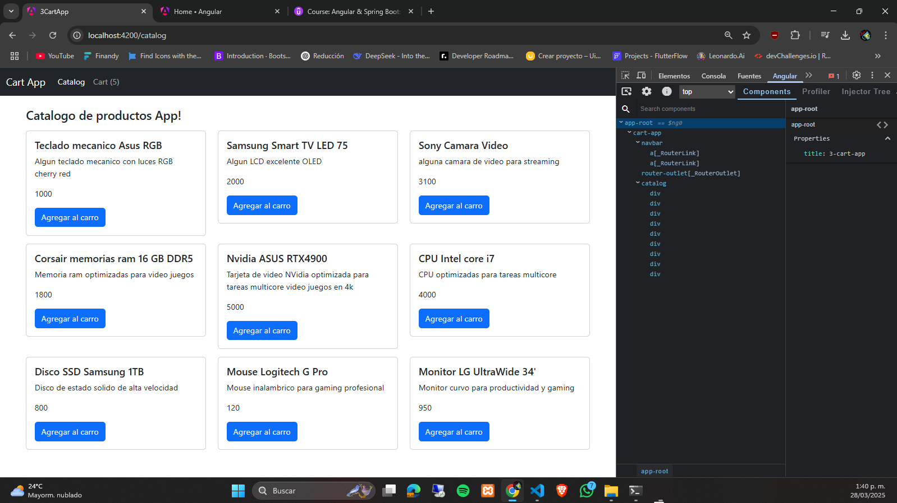
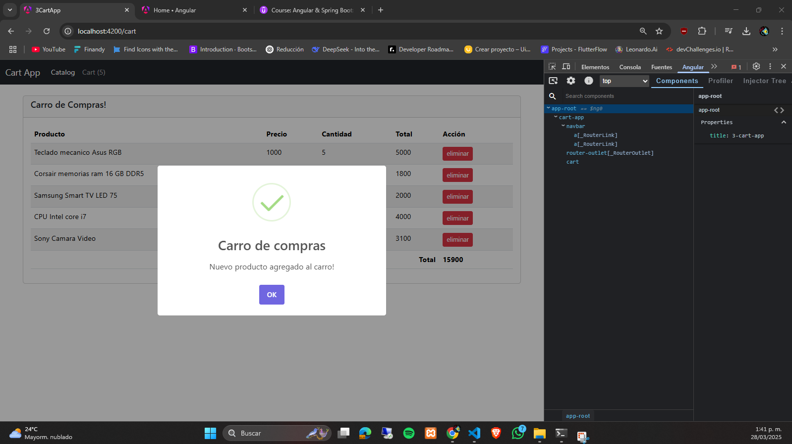
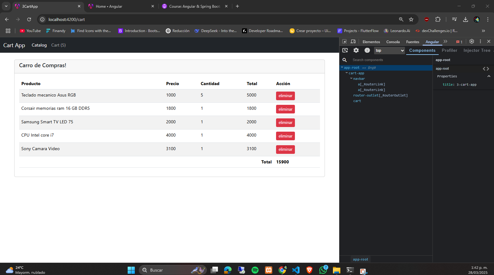
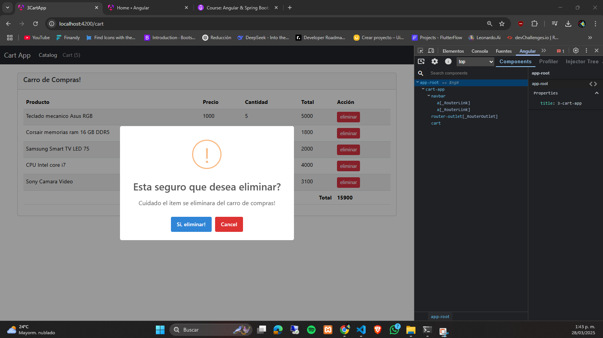

# Carrito de Compras en Angular con Redux



<br>



## 🎥 Video Demostración - Carrito Angular + Redux
<a href="https://www.youtube.com/watch?v=ccEx0ti5pVA" target="_blank">
  
</a>

## Tabla de Contenidos
- [Descripción](#descripción)
- [Características](#características)
- [Tecnologías](#tecnologías)
- [Instalación](#instalación)

## Descripción
Aplicación de carrito de compras desarrollada en Angular con TypeScript y Redux (@ngrx/store) para gestión de estado global, implementando buenas prácticas de desarrollo.

## Características
- 🛒 Gestión completa de carrito (añadir/eliminar/actualizar cantidades)
- 📱 Diseño responsive (tablet/desktop)
- 🔄 Estado global con Redux
- 🧩 Componentes reutilizables
- ✅ Validación de datos de la tabla

## Tecnologías
| Tecnología | Uso |
|------------|-----|
| Angular | Framework principal |
| TypeScript | Tipado estático |
| Redux (@ngrx/store) | Gestión de estado |
| RxJS | Programación reactiva |
| HTML5/CSS3 | Maquetación |
| Bootstrap  | Estilos |

## Instalación
```bash
# 1. Clonar repositorio
git clone https://github.com/53R610-D4V1D/3-cart-app

# 2. Instalar dependencias
npm install

# 3. Iniciar servidor de desarrollo
ng serve

# 4. Abrir en navegador
http://localhost:4200

Estructura del Proyecto
src/
├── app/
│   ├── components/       # Componentes reutilizables
│   ├── store/            # Configuración Redux
│   │   ├── actions/
│   │   ├── reducers/
│   │   └── selectors/
│   ├── models/           # Interfaces TypeScript
│   └── services/         # Lógica de negocio
├── assets/               # Recursos estáticos
└── environments/         # Configuraciones
```